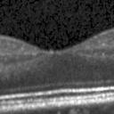
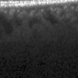
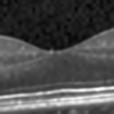
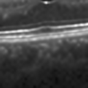
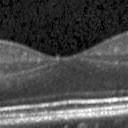
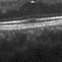
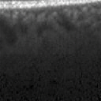

# SRGAN-OCT
This repostiory hosts the code to train a Super Resolution Generative Adversarial Network(SRGAN) on Retinal Optical Coherence Tomography (OCT) to generate higher resolution OCT data from lower resolution. The training code is adopted from [SRGAN-PyTorch](https://github.com/Lornatang/SRGAN-PyTorch) and modified to support gradient penalty content loss with clipping, which helps with convergence ands stability when using the discriminator-based variant.

## Dataset
You can obtain the dataset from [this kaggle](https://www.kaggle.com/datasets/paultimothymooney/kermany2018) webpage.

## Model Weights
You need Imagenet Generator and Discriminator Weights for fine-tuning. Using [SRGAN-PyTorch](https://github.com/Lornatang/SRGAN-PyTorch)'s scripts:
```bash
# Download `SRGAN_x4-ImageNet.pth.tar` weights to `./results/pretrained_models`
$ bash ./scripts/download_weights.sh SRGAN_x4-ImageNet
# Download `SRResNet_x4-ImageNet.pth.tar` weights to `./results/pretrained_models`
$ bash ./scripts/download_weights.sh SRResNet_x4-ImageNet
# Download `DiscriminatorForVGG_x4-ImageNet.pth.tar` weights to `./results/pretrained_models`
$ bash ./scripts/download_weights.sh DiscriminatorForVGG_x4-ImageNet
```
Additionally, the trained weights on the Retinal OCT dataset are provided: [OCT_SRResNet_x4](https://drive.google.com/file/d/1Kr8Wh3n2h_iGvXAXlhPtm2yV-xt2Ne_F/view?usp=sharing), [OCT_SRGAN_x4](https://drive.google.com/file/d/1wVL1wzXru-1EJuBbgE1sB6dJzgzfahBA/view?usp=sharing)

where they should be extracted into `results/`

## Dependency installation
Use `venv` or `uv`:
```bash
uv venv srgan --python 3.12
source ./srgan/bin/activate
uv pip install -e .
```
## Training and Generation
To train the model, change all `DATASET` locations in [configs/train/OCT_SRGAN_x4.yaml](configs/train/OCT_SRGAN_x4.yaml) for SRGAN training, and [configs/train/OCT_SRResNet_x4.yaml](configs/train/OCT_SRResNet_x4.yaml) for SRResNet training. To use a pretrained model set `PRETRAINED_G_MODEL` and `PRETRAINED_D_MODEL` for SRGAN training, and only `PRETRAINED_G_MODEL` for SRResNet training. You can change the upscaling multiple and image size accordingly, if desired.
 Train using:

```bash
python oct_train_net.py --config_path configs/train/OCT_SRResNet_x4.yaml # SRResNet training
python3 oct_gan_train.py --config configs/train/OCT_SRGAN_x4.yaml  # SRGAN training 
```
Make sure to login to your wandb account, or have the token saved on to disk. To view logs saved on disk, for example `sample/logs`, you can use tensorboard:
```bash
python3 -m tensorboard.main --logdir="samples/logs"
```
and then head to `localhost:6060` on your browser.

To generate images from your low-resolution dataset, edit [config_imagegen.yaml](config_imagegen.yaml) with correct model checkpoints provided in `results` (e.g. OCT_STGAN_x4_2's weights) and dataset paths and run:
```bash
 python3 gen_data.py --config config_imagegen.yaml
 ```

## Image Generation Results
Training SRResNet is generally easier and more stable than SRGAN with discriminator and adversarial loss. But due to having a simple pixel loss, the generations are steered towards smoothed images with more noise reduction per each training step, while fidelity hardly improves. Interestingly, this is also hardly reflected in both PSNR and SSIM as they both positively correlate with smoother images. On the other hand, typical SRGAN training is highly unstable, and would lead to a dominating discriminator most of the times. To counteract this, a larger weight was given to the discriminator loss, while a [gradient penalty Wasserstein-GAN](https://arxiv.org/abs/1704.00028) was added,  which improved training significantly. On top of that, gradient clipping which is essential to Wasserstein-GAN losses is utilized as well.

Here are the quantitative results under both settings:

|           | **PSNR**   |    **SSIM** |
|--------:|----------:|-------:|
|    **SRResNet**  |   31.38  |     80.83  |
|   **SRGAN**    |    31.07  |     79.84  |

Interestingly, training SRGAN for longer than 10 epochs diminishes the generation quality, before slowly recovering the sharper details after around 80 epochs.

You can check the loss curves and graphs by running tensorboard against the logs at `samples/logs`.

Here are some qualitative examples with their ground truths(128x128), low resolution input(32x32) and generated super-resolution image(128x128):

| Ground truth | Ground truth | Ground truth |
|---|---|---|
|  |  |  |
| Low resolution | Low resolution | Low resolution |
|  |  |  |
| SRResNet output | SRResNet output | SRResNet output |
|  |  |  |
| SRGAN output | SRGAN output | SRGAN output |
|  |  |  |

### Classification Results
To run classification, use [ResNetClassification.ipynb](./ResNetClassification.ipynb) notebook and only change the cell containing `prefix_path` and `original_or_sr`(set it either to `gan` or `original`). Here are the classification comparisons with the original dataset at 128x128 resolution and the GAN-generated dataset:

#### Original Dataset
| Class   | Precision | Recall | F1-score | Support |
|--------:|----------:|-------:|---------:|--------:|
| NORMAL  | 1.00      | 0.96   | 0.98     | 437     |
| DME     | 0.94      | 1.00   | 0.97     | 305     |
| DRUSEN  | 1.00      | 0.98   | 0.99     | 221     |
| **accuracy**   |          |        | **0.98** | 963     |
| **macro avg**  | 0.98      | 0.98   | 0.98     | 963     |
| **weighted avg** | 0.98      | 0.98   | 0.98     | 963     |

F1 Score: 0.9790

#### SRResNet
| Class   | Precision | Recall | F1-score | Support |
|--------:|----------:|-------:|---------:|--------:|
| NORMAL  | 1.00      | 0.77   | 0.87     | 437     |
| DME     | 0.66      | 0.77   | 0.71     | 305     |
| DRUSEN  | 0.66      | 0.81   | 0.73     | 221     |
| **accuracy**   |          |        | **0.78** | 963     |
| **macro avg**  | 0.77      | 0.78   | 0.77     | 963     |
| **weighted avg** | 0.81      | 0.78   | 0.79     | 963     |

F1 Score: 0.7697

Confusion matrix and AUC curves can be found under ["results/classification/](./results/classification/)